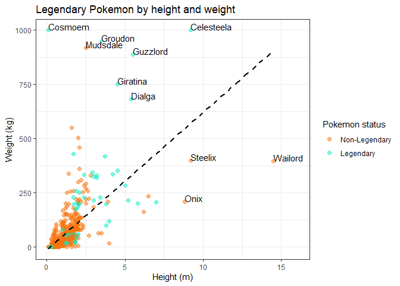
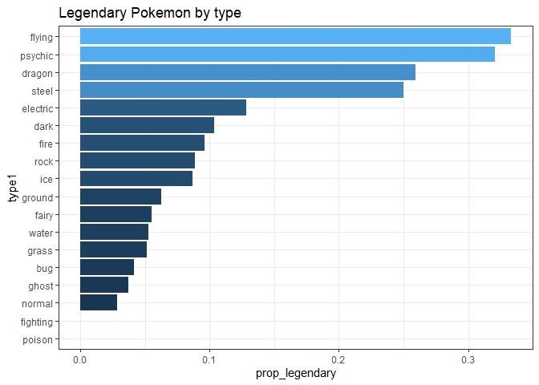
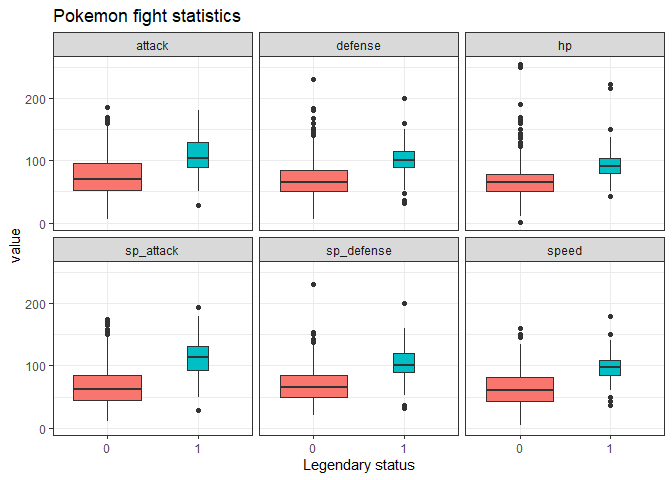
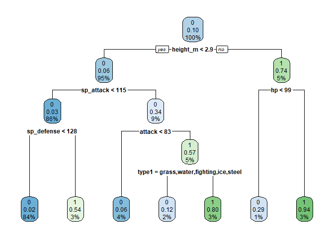
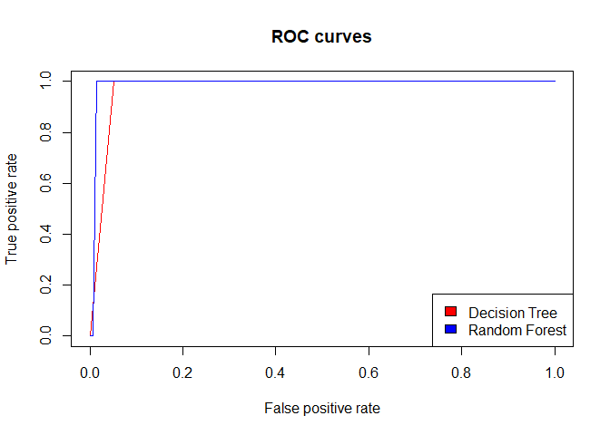
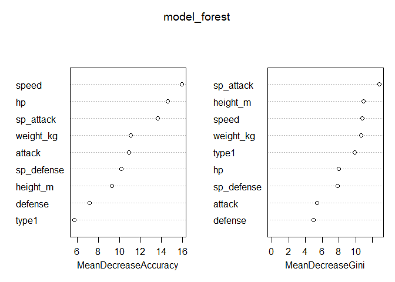

<style type="text/css">
  body{
  font-size: 12pt;
  font-family: 'Monaco', 'Courier New', monospace;
}
</style>

# Introduction

This report provides an analysis of the Pokemon dataset using R and
various statistical and machine learning techniques. The analysis
includes data exploration, visualization, and the development of
predictive models to determine if a Pokemon is legendary. The data was
obtained from
[here](https://www.kaggle.com/datasets/rounakbanik/pokemon/)

Let’s first load necessary packages:

``` r
library(tidyverse)    # data manipulation and visualization
library(rpart)        # decision trees
library(rpart.plot)   # decision tree plotting
library(randomForest) # random forest packages
library(ROCR)         # classifcations + AUC 
```

# Data Exploration

We can start by importing the dataset, please change path as needed.

``` r
# Import dataset
pokedex <- read_csv("data/pokemon.csv", 
                    col_types = cols(name = col_factor(), 
                                     type1 = col_factor(),
                                     is_legendary = col_factor()))
```

## Dataset Overview

``` r
# Display the first six rows
head(pokedex)
```

    ## # A tibble: 6 × 41
    ##   abilities        against_bug against_dark against_dragon against_electric against_fairy
    ##   <chr>                  <dbl>        <dbl>          <dbl>            <dbl>         <dbl>
    ## 1 ['Overgrow', 'C…        1               1              1              0.5           0.5
    ## 2 ['Overgrow', 'C…        1               1              1              0.5           0.5
    ## 3 ['Overgrow', 'C…        1               1              1              0.5           0.5
    ## 4 ['Blaze', 'Sola…        0.5             1              1              1             0.5
    ## 5 ['Blaze', 'Sola…        0.5             1              1              1             0.5
    ## 6 ['Blaze', 'Sola…        0.25            1              1              2             0.5
    ## # ℹ 35 more variables: against_fight <dbl>, against_fire <dbl>, against_flying <dbl>,
    ## #   against_ghost <dbl>, against_grass <dbl>, against_ground <dbl>, against_ice <dbl>,
    ## #   against_normal <dbl>, against_poison <dbl>, against_psychic <dbl>,
    ## #   against_rock <dbl>, against_steel <dbl>, against_water <dbl>, attack <dbl>,
    ## #   base_egg_steps <dbl>, base_happiness <dbl>, base_total <dbl>, capture_rate <chr>,
    ## #   classfication <chr>, defense <dbl>, experience_growth <dbl>, height_m <dbl>,
    ## #   hp <dbl>, japanese_name <chr>, name <fct>, percentage_male <dbl>, …

``` r
# Examine the structure
glimpse(pokedex)
```

    ## Rows: 801
    ## Columns: 41
    ## $ abilities         <chr> "['Overgrow', 'Chlorophyll']", "['Overgrow', 'Chlorophyll']",…
    ## $ against_bug       <dbl> 1.00, 1.00, 1.00, 0.50, 0.50, 0.25, 1.00, 1.00, 1.00, 1.00, 1…
    ## $ against_dark      <dbl> 1, 1, 1, 1, 1, 1, 1, 1, 1, 1, 1, 1, 1, 1, 1, 1, 1, 1, 1, 1, 1…
    ## $ against_dragon    <dbl> 1, 1, 1, 1, 1, 1, 1, 1, 1, 1, 1, 1, 1, 1, 1, 1, 1, 1, 1, 1, 1…
    ## $ against_electric  <dbl> 0.5, 0.5, 0.5, 1.0, 1.0, 2.0, 2.0, 2.0, 2.0, 1.0, 1.0, 2.0, 1…
    ## $ against_fairy     <dbl> 0.5, 0.5, 0.5, 0.5, 0.5, 0.5, 1.0, 1.0, 1.0, 1.0, 1.0, 1.0, 0…
    ## $ against_fight     <dbl> 0.50, 0.50, 0.50, 1.00, 1.00, 0.50, 1.00, 1.00, 1.00, 0.50, 0…
    ## $ against_fire      <dbl> 2.0, 2.0, 2.0, 0.5, 0.5, 0.5, 0.5, 0.5, 0.5, 2.0, 2.0, 2.0, 2…
    ## $ against_flying    <dbl> 2.0, 2.0, 2.0, 1.0, 1.0, 1.0, 1.0, 1.0, 1.0, 2.0, 2.0, 2.0, 2…
    ## $ against_ghost     <dbl> 1, 1, 1, 1, 1, 1, 1, 1, 1, 1, 1, 1, 1, 1, 1, 0, 0, 0, 0, 0, 0…
    ## $ against_grass     <dbl> 0.25, 0.25, 0.25, 0.50, 0.50, 0.25, 2.00, 2.00, 2.00, 0.50, 0…
    ## $ against_ground    <dbl> 1.0, 1.0, 1.0, 2.0, 2.0, 0.0, 1.0, 1.0, 1.0, 0.5, 0.5, 0.0, 1…
    ## $ against_ice       <dbl> 2.0, 2.0, 2.0, 0.5, 0.5, 1.0, 0.5, 0.5, 0.5, 1.0, 1.0, 2.0, 1…
    ## $ against_normal    <dbl> 1, 1, 1, 1, 1, 1, 1, 1, 1, 1, 1, 1, 1, 1, 1, 1, 1, 1, 1, 1, 1…
    ## $ against_poison    <dbl> 1.0, 1.0, 1.0, 1.0, 1.0, 1.0, 1.0, 1.0, 1.0, 1.0, 1.0, 1.0, 0…
    ## $ against_psychic   <dbl> 2, 2, 2, 1, 1, 1, 1, 1, 1, 1, 1, 1, 2, 2, 2, 1, 1, 1, 1, 1, 1…
    ## $ against_rock      <dbl> 1.0, 1.0, 1.0, 2.0, 2.0, 4.0, 1.0, 1.0, 1.0, 2.0, 2.0, 4.0, 2…
    ## $ against_steel     <dbl> 1.0, 1.0, 1.0, 0.5, 0.5, 0.5, 0.5, 0.5, 0.5, 1.0, 1.0, 1.0, 1…
    ## $ against_water     <dbl> 0.5, 0.5, 0.5, 2.0, 2.0, 2.0, 0.5, 0.5, 0.5, 1.0, 1.0, 1.0, 1…
    ## $ attack            <dbl> 49, 62, 100, 52, 64, 104, 48, 63, 103, 30, 20, 45, 35, 25, 15…
    ## $ base_egg_steps    <dbl> 5120, 5120, 5120, 5120, 5120, 5120, 5120, 5120, 5120, 3840, 3…
    ## $ base_happiness    <dbl> 70, 70, 70, 70, 70, 70, 70, 70, 70, 70, 70, 70, 70, 70, 70, 7…
    ## $ base_total        <dbl> 318, 405, 625, 309, 405, 634, 314, 405, 630, 195, 205, 395, 1…
    ## $ capture_rate      <chr> "45", "45", "45", "45", "45", "45", "45", "45", "45", "255", …
    ## $ classfication     <chr> "Seed Pokémon", "Seed Pokémon", "Seed Pokémon", "Lizard Pokém…
    ## $ defense           <dbl> 49, 63, 123, 43, 58, 78, 65, 80, 120, 35, 55, 50, 30, 50, 40,…
    ## $ experience_growth <dbl> 1059860, 1059860, 1059860, 1059860, 1059860, 1059860, 1059860…
    ## $ height_m          <dbl> 0.7, 1.0, 2.0, 0.6, 1.1, 1.7, 0.5, 1.0, 1.6, 0.3, 0.7, 1.1, 0…
    ## $ hp                <dbl> 45, 60, 80, 39, 58, 78, 44, 59, 79, 45, 50, 60, 40, 45, 65, 4…
    ## $ japanese_name     <chr> "Fushigidaneフシギダネ", "Fushigisouフシギソウ", "Fushigibana…
    ## $ name              <fct> Bulbasaur, Ivysaur, Venusaur, Charmander, Charmeleon, Chariza…
    ## $ percentage_male   <dbl> 88.1, 88.1, 88.1, 88.1, 88.1, 88.1, 88.1, 88.1, 88.1, 50.0, 5…
    ## $ pokedex_number    <dbl> 1, 2, 3, 4, 5, 6, 7, 8, 9, 10, 11, 12, 13, 14, 15, 16, 17, 18…
    ## $ sp_attack         <dbl> 65, 80, 122, 60, 80, 159, 50, 65, 135, 20, 25, 90, 20, 25, 15…
    ## $ sp_defense        <dbl> 65, 80, 120, 50, 65, 115, 64, 80, 115, 20, 25, 80, 20, 25, 80…
    ## $ speed             <dbl> 45, 60, 80, 65, 80, 100, 43, 58, 78, 45, 30, 70, 50, 35, 145,…
    ## $ type1             <fct> grass, grass, grass, fire, fire, fire, water, water, water, b…
    ## $ type2             <chr> "poison", "poison", "poison", NA, NA, "flying", NA, NA, NA, N…
    ## $ weight_kg         <dbl> 6.9, 13.0, 100.0, 8.5, 19.0, 90.5, 9.0, 22.5, 85.5, 2.9, 9.9,…
    ## $ generation        <dbl> 1, 1, 1, 1, 1, 1, 1, 1, 1, 1, 1, 1, 1, 1, 1, 1, 1, 1, 1, 1, 1…
    ## $ is_legendary      <fct> 0, 0, 0, 0, 0, 0, 0, 0, 0, 0, 0, 0, 0, 0, 0, 0, 0, 0, 0, 0, 0…

### Legendary Pokemon Proportion

``` r
# Prepare the data
legendary_pokemon <- pokedex %>% 
  count(is_legendary) %>% 
  mutate(prop = n / nrow(pokedex))

# Print the data frame
head(legendary_pokemon)
```

    ## # A tibble: 2 × 3
    ##   is_legendary     n   prop
    ##   <fct>        <int>  <dbl>
    ## 1 0              731 0.913 
    ## 2 1               70 0.0874

## Visualisations

Creating visualisations is a useful way of identifiying trends in our
data.

### Pokemon Distribution by Height and Weight

``` r
# Prepare the plot
legend_by_heightweight_plot <- pokedex %>% 
  ggplot(aes(x = height_m, y = weight_kg)) +
  geom_point(aes(color = is_legendary), size = 2, alpha = 0.5) +
  geom_text(aes(label = ifelse(height_m > 7.5|weight_kg > 600, 
                            as.character(name), '')), vjust = 0, hjust = 0) +
  geom_smooth(method = "lm", se = FALSE, col = "black", linetype = "dashed") +
  expand_limits(x = 16) +
  labs(title = "Legendary Pokemon by height and weight",
       x = "Height (m)",
       y = "Weight (kg)") +
  guides(color = guide_legend(title = "Pokemon status")) +
  scale_color_manual(labels = c("Non-Legendary", "Legendary"),
                     values = c("#F8730D", "#00eFC4")) +
  theme_bw()

# Print the plot
legend_by_heightweight_plot
```



### Proportion of Legendary Pokemon by Type

``` r
# Prepare the data
legend_by_type <- pokedex %>% 
    group_by(type1) %>% 
    mutate(is_legendary = as.numeric(is_legendary) - 1) %>% 
    summarise(prop_legendary = mean(is_legendary)) %>% 
    ungroup() %>% 
    mutate(type1 = fct_reorder(type1, prop_legendary))

# Prepare the plot
legend_by_type_plot <- legend_by_type %>% 
    ggplot(aes(x = type1, y = prop_legendary, fill = prop_legendary)) + 
    geom_col() +
    labs(title = "Legendary Pokemon by type") +
    coord_flip() +
    guides(fill = "none") + theme_bw()

# Print the plot
legend_by_type_plot
```



### Pokemon Fight Statistics

``` r
# Prepare the data
legend_by_stats <- pokedex  %>% 
  select(is_legendary, attack, sp_attack, defense, sp_defense, hp, speed)  %>% 
  gather(key = "fght_stats", value = "value", -is_legendary) 

# Prepare the plot
legend_by_stats_plot <- legend_by_stats %>% 
 ggplot(aes(x = is_legendary, y = value, fill = is_legendary)) +
 geom_boxplot(varwidth = TRUE) +
 facet_wrap(~fght_stats) +
 labs(title = "Pokemon fight statistics",
        x = "Legendary status") +
 guides(fill = "none") + theme_bw()

# Print the plot
legend_by_stats_plot
```



# Machine Learning Analysis

## Data Splitting

``` r
# Set seed for reproducibility
set.seed(1234)

# Save number of rows in dataset
n <- nrow(pokedex)

# Generate 60% sample of rows
sample_rows <- sample(n, 0.6 * n)

# Create training set
pokedex_train <- pokedex  %>% 
  filter(row_number() %in% sample_rows) 

# Create test set
pokedex_test <- pokedex  %>% 
  filter(!row_number() %in% sample_rows) %>%
  na.omit()
```

## Decision Tree Model

``` r
# Load packages and set seed
set.seed(1234)

# Fit decision tree
model_tree <- rpart(is_legendary ~ attack + defense + height_m + 
                    hp + sp_attack + sp_defense + speed + type1 + weight_kg,
                       data = pokedex_train,
                       method = "class",
                       na.action = na.omit)

# Plot decision tree
rpart.plot(model_tree)
```



## Random Forest Model

``` r
# Load package and set seed
set.seed(1234)

# Fit random forest
model_forest <- randomForest(is_legendary ~ attack + defense + height_m + 
                         hp + sp_attack + sp_defense + speed + type1 + weight_kg,
                         data = pokedex_train,
                         importance = TRUE,
                         na.action = na.omit)

# Print model output
model_forest
```

    ## 
    ## Call:
    ##  randomForest(formula = is_legendary ~ attack + defense + height_m +      hp + sp_attack + sp_defense + speed + type1 + weight_kg,      data = pokedex_train, importance = TRUE, na.action = na.omit) 
    ##                Type of random forest: classification
    ##                      Number of trees: 500
    ## No. of variables tried at each split: 3
    ## 
    ##         OOB estimate of  error rate: 6.18%
    ## Confusion matrix:
    ##     0  1 class.error
    ## 0 419  5  0.01179245
    ## 1  24 21  0.53333333

## Model Evaluation - ROC Curves

``` r
# Create prediction and performance objects for the decision tree
probs_tree <- predict(model_tree, pokedex_test, type = "prob")
pred_tree <- prediction(probs_tree[,2], pokedex_test$is_legendary)
perf_tree <- performance(pred_tree, "tpr", "fpr")

# Create prediction and performance objects for the random forest
probs_forest <- predict(model_forest, pokedex_test, type = "prob")
pred_forest <- prediction(probs_forest[,2], pokedex_test$is_legendary)
perf_forest <- performance(pred_forest, "tpr", "fpr")

# Plot the ROC curves
plot(perf_tree, col = "red", main = "ROC curves")
plot(perf_forest, add = TRUE, col = "blue")
legend(x = "bottomright",  legend = c("Decision Tree", "Random Forest"), fill = c("red", "blue"))
```



## Random Forest Variable Importance

``` r
# Print variable importance measures
importance_forest <- importance(model_forest)
importance_forest
```

    ##                   0         1 MeanDecreaseAccuracy MeanDecreaseGini
    ## attack     6.057177 10.090444            10.943867         5.433364
    ## defense    3.447970  7.777740             7.157058         4.974372
    ## height_m   1.970646 11.699348             9.330406        10.922078
    ## hp         6.684172 15.982089            14.575125         7.976519
    ## sp_attack  1.625093 19.743620            13.648709        12.835879
    ## sp_defense 4.799102 11.611696            10.195838         7.860335
    ## speed      4.346961 20.939571            15.937450        10.787632
    ## type1      4.389508  4.247149             5.735069         9.863498
    ## weight_kg  7.811610  9.608579            11.100255        10.670094

``` r
# Create a dotchart of variable importance
varImpPlot_forest <- varImpPlot(model_forest)
```



``` r
varImpPlot_forest
```

    ##            MeanDecreaseAccuracy MeanDecreaseGini
    ## attack                10.943867         5.433364
    ## defense                7.157058         4.974372
    ## height_m               9.330406        10.922078
    ## hp                    14.575125         7.976519
    ## sp_attack             13.648709        12.835879
    ## sp_defense            10.195838         7.860335
    ## speed                 15.937450        10.787632
    ## type1                  5.735069         9.863498
    ## weight_kg             11.100255        10.670094

# Conclusion

In conclusion, this analysis provides insights into the distribution of
Pokemon by various attributes and explores the predictive capabilities
of decision tree and random forest models. The ROC curves and variable
importance measures offer valuable information about the performance and
key factors influencing the models.
